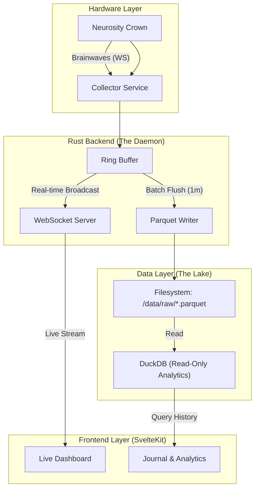

# Observable (Mind Observability)

**Observable** is a real-time EEG dashboard and analytics platform for the Neurosity Crown. It treats your brainwaves like server logs—capturing, visualizing, and analyzing your mental state to help you debug anxiety, focus, and flow.

## The Vision
"Observability for the Mind." Just as we monitor server latency and error rates, **Observable** monitors focus metrics and calm states, allowing for data-driven self-regulation.

## Architecture

We use a **Daemon/UI** split with a **Parquet Lake** storage strategy to avoid database locks and ensure high-throughput ingestion.



## Tech Stack

*   **Collector:** Rust (Tokio, Tungstenite, Reqwest, Parquet/Arrow)
*   **Storage:** Parquet Files (Time-partitioned)
*   **Analytics:** DuckDB (Embedded)
*   **Frontend:** SvelteKit + Tailwind
*   **Hardware:** Neurosity Crown

## Setup

### Prerequisites
*   Rust (cargo)
*   Neurosity Device (Crown)
*   Credentials (in `.env`)
*   `libssl-dev` (if using OpenSSL, though we now default to `rustls`)

### Quick Start

1.  **Configure Env:**
    ```bash
    cp .env.example .env
    # Add DEVICE_ID, EMAIL, PASSWORD
    ```

2.  **Run the Daemon (Phase 2):**
    ```bash
    cargo run
    ```
    This will:
    - Start the **Collector** (authenticates & streams from Neurosity).
    - Start the **WebSocket Server** on `ws://127.0.0.1:3000`.
    - Start the **Parquet Writer** (flushes to `data/raw/` every ~60s).

3.  **Verify:**
    - **Logs:** Watch the terminal for "Collector: Streaming..." and "ParquetWriter: Flushed...".
    - **WebSocket:** Connect with `wscat -c ws://localhost:3000` to see live JSON.
    - **Files:** Check `ls -R data/raw/` after a minute.

## Development Status
*   [x] **Phase 1:** Hello Brain (Connect & Stream to Console)
*   [x] **Phase 2:** Data Pipeline (Parquet Writer & WebSocket)
*   [ ] **Phase 3:** Visualization (SvelteKit UI)
*   [ ] **Phase 4:** Intelligence (AI Analysis)

---
*Built in public by @whoisbe & Veda.*
