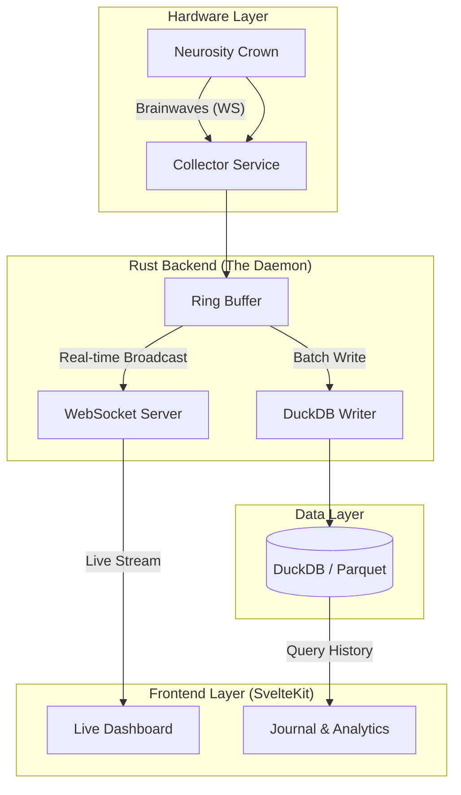

# Observable (Mind Observability)

**Observable** is a real-time EEG dashboard and analytics platform for the Neurosity Crown. It treats your brainwaves like server logs—capturing, visualizing, and analyzing your mental state to help you debug anxiety, focus, and flow.

## The Vision
"Observability for the Mind." Just as we monitor server latency and error rates, **Observable** monitors focus metrics and calm states, allowing for data-driven self-regulation.

## Architecture

We use a **Daemon/UI** split to ensure zero-latency visualization while persisting high-resolution data for analysis.



## Tech Stack

*   **Collector:** Rust (Tokio, Tungstenite, Reqwest)
*   **Storage:** DuckDB (Embedded OLAP)
*   **Frontend:** SvelteKit + Tailwind
*   **Hardware:** Neurosity Crown

## Setup

### Prerequisites
*   Rust (cargo)
*   Neurosity Device (Crown)
*   Credentials (in `.env`)

### Quick Start

1.  **Configure Env:**
    ```bash
    cp .env.example .env
    # Add DEVICE_ID, EMAIL, PASSWORD
    ```

2.  **Run the Daemon:**
    ```bash
    cargo run
    ```

## Development Status
*   [ ] **Phase 1:** Hello Brain (Connect & Stream to Console)
*   [ ] **Phase 2:** Data Pipeline (DuckDB Integration)
*   [ ] **Phase 3:** Visualization (SvelteKit UI)
*   [ ] **Phase 4:** Intelligence (AI Analysis)

---
*Built in public by @whoisbe & Veda.*
