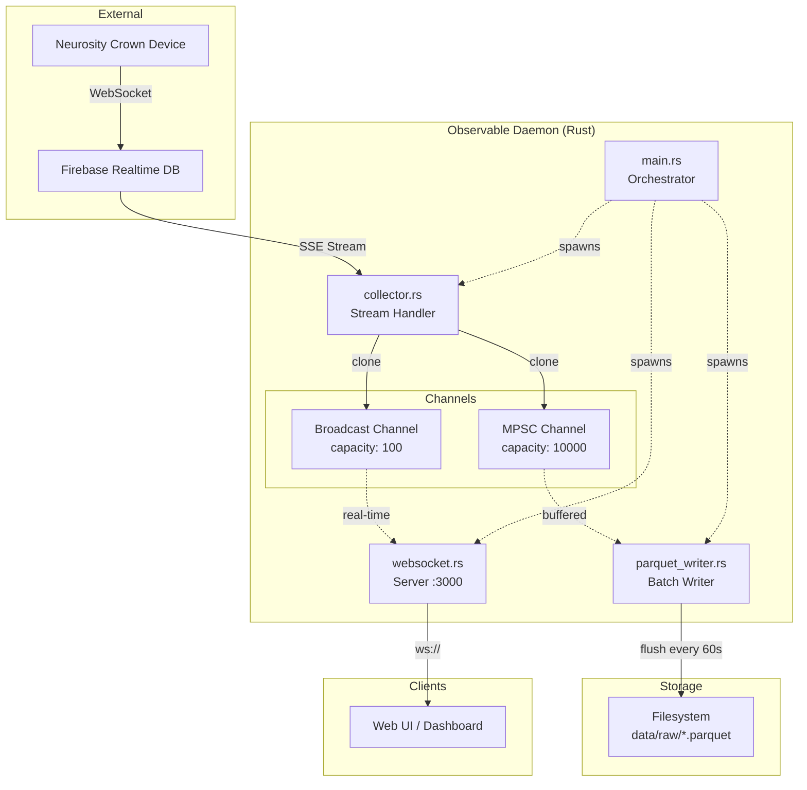

# Observable - How it Works

**Observable** is a real-time EEG brainwave streaming and analytics platform that collects data from a Neurosity Crown device. It's built with Rust and uses a "Parquet Lake" architecture for high-throughput data ingestion.

## Architecture Overview



## Core Components

### 1. **Main Entry Point** (`main.rs`)

The orchestrator that sets up channels and spawns concurrent tasks:

```rust
async fn main() -> Result<(), Box<dyn std::error::Error>> {
    let (broadcast_tx, _) = broadcast::channel(100);  // For WebSocket
    let (mpsc_tx, mpsc_rx) = mpsc::channel(10000);   // For Parquet writer
    
    tokio::spawn(collector::run(broadcast_tx.clone(), mpsc_tx.clone()));
    tokio::spawn(websocket::run(broadcast_tx.subscribe()));
    tokio::spawn(parquet_writer::run(mpsc_rx));
    
    signal::ctrl_c().await?;
    Ok(())
}
```

**Key responsibilities:**
- Initialize shared channels
- Spawn asynchronous tasks
- Handle graceful shutdown

### 2. **Collector** (`collector.rs`)

Streams EEG data from Firebase Realtime Database and clones each sample to both channels:

```rust
async fn run(broadcast_tx: Sender<Sample>, mpsc_tx: Sender<Sample>) {
    // Authenticate with Firebase
    let token = firebase_login(...).await?;
    
    // Subscribe to brainwaves metric
    let stream = subscribe_to_brainwaves(device_id, token).await?;
    
    // Clone incoming samples to both channels
    while let Some(sample) = stream.next().await {
        let _ = broadcast_tx.send(sample.clone());  // Non-blocking
        let _ = mpsc_tx.send(sample).await;         // Buffered
    }
}
```

**Key features:**
- Firebase SSE (Server-Sent Events) streaming
- Dual-channel fanout pattern
- Zero-copy where possible

### 3. **WebSocket Server** (`websocket.rs`)

Serves real-time samples to connected clients:

```rust
async fn run(mut rx: broadcast::Receiver<Sample>) {
    let listener = TcpListener::bind("127.0.0.1:3000").await?;
    
    while let Ok((stream, _)) = listener.accept().await {
        let mut client_rx = rx.resubscribe();
        tokio::spawn(async move {
            let ws = accept_async(stream).await?;
            while let Ok(sample) = client_rx.recv().await {
                ws.send(Message::Text(serde_json::to_string(&sample)?)).await?;
            }
        });
    }
}
```

**Key features:**
- Broadcast channel allows multiple subscribers
- Lagging clients are dropped (not buffered)
- JSON serialization over WebSocket

### 4. **Parquet Writer** (`parquet_writer.rs`)

Buffers samples in memory and flushes to Parquet files periodically:

```rust
async fn run(mut rx: mpsc::Receiver<Sample>) {
    let mut buffer = Vec::with_capacity(10000);
    let mut last_flush = Instant::now();
    
    while let Some(sample) = rx.recv().await {
        buffer.push(sample);
        
        if last_flush.elapsed() > Duration::from_secs(60) || buffer.len() >= 10000 {
            flush_to_parquet(&buffer).await?;
            buffer.clear();
            last_flush = Instant::now();
        }
    }
}
```

**Key features:**
- Time-based flushing (every 60 seconds)
- Size-based flushing (10,000 samples)
- Columnar storage for efficient analytics

## Data Flow

1. **Neurosity Crown** → Captures 256Hz EEG data (8 channels)
2. **Firebase Realtime DB** → Relays data via Server-Sent Events
3. **Collector** → Receives SSE stream and clones to two channels:
   - **Broadcast Channel** (capacity: 100) → Low-latency real-time streaming
   - **MPSC Channel** (capacity: 10,000) → Buffered writes
4. **WebSocket Server** → Serves live data to web clients
5. **Parquet Writer** → Batches and persists data to disk

## Channel Strategy

### Broadcast Channel (real-time path)
- **Capacity:** 100 samples (~0.4 seconds at 256Hz)
- **Behavior:** Drops lagging receivers
- **Use case:** Live visualization where missing samples is acceptable

### MPSC Channel (persistence path)
- **Capacity:** 10,000 samples (~39 seconds at 256Hz)
- **Behavior:** Blocks sender if full (backpressure)
- **Use case:** Durable storage where every sample matters

## Storage Format

### Parquet Schema

```rust
struct BrainwaveSample {
    timestamp: i64,           // Unix millis
    device_id: String,        // Crown device ID
    channels: [f32; 8],       // CP3, C3, F5, PO3, PO4, F6, C4, CP4
    sample_rate: i32,         // Always 256Hz
}
```

### File Organization

```
data/
  raw/
    2024-01-15-14-30-00.parquet  # One file per minute
    2024-01-15-14-31-00.parquet
    ...
```

## Performance Characteristics

- **Throughput:** 256 samples/sec × 8 channels = 2,048 values/sec
- **Latency:** <10ms from device to WebSocket clients
- **Memory:** ~400KB buffer before flush (10,000 samples × ~40 bytes)
- **Disk:** ~2.5MB/hour compressed Parquet files

## Why This Architecture?

1. **Decoupled concerns:** Real-time serving and durable storage are independent
2. **Backpressure handling:** MPSC channel prevents memory exhaustion
3. **Observability:** Parquet files enable historical analysis
4. **Simplicity:** Single binary, no external message broker

## Future Enhancements

- [ ] DuckDB integration for in-process analytics
- [ ] Compression tuning (Snappy vs. Zstd)
- [ ] Multi-device support
- [ ] Time-series downsampling for long-term trends
